# 🚀 Momentum: AI-Powered Personal OS for Atomic Habits

[](https://momentum-agent.streamlit.app/)

[](https://ai.google.dev/)

[](https://langchain-ai.github.io/langgraph/)

> **"You do not rise to the level of your goals. You fall to the level of your systems."** — James Clear

## 💡 The Problem

We all have goals. But **Executive Dysfunction**, **Anxiety**, and **Motivation Dips** often stand in the way.

Standard to-do lists fail because they ignore the *human* element: our energy fluctuates, and our brains resist change. We fall into the "False Hope Syndrome"—setting vague goals and quitting when things get hard.

## 🛠️ The Solution

**Momentum** is a state-aware AI Agent that acts as your **Personal Concierge for Execution**.

It doesn't just track tasks; it negotiates with you. It integrates behavioral psychology principles (Atomic Habits, The 12-Week Year) to guide you from "I want to" to "I did it."

## ✨ Key Features (The 4-Agent System)

Momentum utilizes a **Supervisor-Worker Architecture** to orchestrate four specialized agents:

1. **🎯 The Strategist:** Helps you define a Vision and create an "Atomic System". It rejects vague goals and ensures specificity.

2. **🧘‍♀️ The Healer (Gemini-Powered Empathy):** Detects emotional distress using Chain-of-Thought reasoning. It validates your feelings to lower the "Amygdala Hijack" response and provides emotional safety.

3. **⚡️ The Starter:** The negotiation coach. It uses "Micro-Habits" to lower the friction of starting (e.g., "Just put on your shoes"). Adapts to your current energy level.

4. **🏗️ The Architect:** Logs your progress into the database and reinforces your Identity Shift through data-driven insights.

### Key Capabilities
- **State-Aware Routing**: The Supervisor intelligently routes you to the right agent based on your needs
- **Dynamic Micro-Actions**: Starter adapts suggestions to your current energy and emotional state
- **Progress Tracking**: Automatic journaling with mood, energy, and completion data
- **Visual Dashboard**: Track your streak, average energy, and action history
- **Safety Guardrails**: Built-in detection for self-harm keywords with appropriate responses

## 🚀 Quick Start

### Prerequisites
- Python 3.9+
- Google Gemini API Key ([Get one here](https://makersuite.google.com/app/apikey))

### Installation

1. **Clone the repository**
   ```bash
   git clone https://github.com/yuping1624/momentum-agent.git
   cd momentum-agent
   ```

2. **Create and activate virtual environment**
   ```bash
   python3 -m venv venv
   source venv/bin/activate  # On Windows: venv\Scripts\activate
   ```

3. **Install dependencies**
   ```bash
   pip install -r requirements.txt
   ```

4. **Set up API Key**

   Option 1: Environment variable (recommended)
   ```bash
   # Create .env file in project root
   echo "GOOGLE_API_KEY=your_api_key_here" > .env
   ```

   Option 2: Streamlit secrets
   ```bash
   # Create .streamlit/secrets.toml
   mkdir -p .streamlit
   echo 'GOOGLE_API_KEY = "your_api_key_here"' > .streamlit/secrets.toml
   ```

5. **Run the application**
   ```bash
   streamlit run app.py
   ```

   Or using Python module:
   ```bash
   python3 -m streamlit run app.py
   ```

The app will open in your browser at `http://localhost:8501`

## 📁 Project Structure

```
momentum-agent/
├── app.py                 # Streamlit UI and user interaction
├── brain.py               # Core logic: Agents, Tools, LangGraph
├── test.py                # CLI testing interface
├── check_models.py        # Model availability checker
├── requirements.txt       # Python dependencies
├── .flake8               # Code quality configuration
├── CODE_QUALITY.md        # Code quality guidelines
├── data/                  # Data persistence
│   ├── user_profile.json  # Current Vision & System (JSON)
│   ├── plans_database.csv # Historical plan changes (CSV)
│   ├── mind_flow_db.csv   # Journal entries (CSV)
│   └── feedback_ratings.csv # User feedback (CSV)
├── logs/                  # Conversation logs
└── scripts/               # Utility scripts
    ├── mock_data.py       # Data generation utilities
    └── *_demo.csv         # Demo data files
```

## 🎯 How It Works

### The Momentum Flow

1. **Onboarding (Strategist)**
   - Set your 12-week Vision (specific, measurable goal)
   - Define your Daily System (tiny, repeatable habit)
   - Plan is automatically saved

2. **Daily Interaction**
   - **Feeling stuck?** → Healer provides emotional support
   - **Ready to act?** → Starter suggests a micro-action based on your energy
   - **Completed something?** → Architect logs your progress

3. **Progress Tracking**
   - Automatic journaling after actions
   - Dashboard shows streak, energy trends, and completion history

### Agent Roles

#### 🧠 Strategist
- **When**: Planning phase, setting goals, asking about concepts
- **What**: Breaks down vague goals into specific 12-week plans with daily systems
- **Philosophy**: "Winners and losers have the same goals. The difference is the SYSTEM."

#### 💚 Healer
- **When**: Emotional distress, external stressors, exhaustion
- **What**: Provides validation, emotional support, and safety
- **Approach**: Validation first, then gentle transition to action

#### 🚀 Starter
- **When**: Ready to act, facing resistance, or procrastinating
- **What**: Generates context-aware micro-actions based on current state
- **Principle**: The action should be so small you can't say no

#### 📊 Architect
- **When**: Task completed, wants to log progress
- **What**: Extracts mood, energy, and completion data from conversation
- **Output**: Journal entry with mood, energy (1-10), and action note

## 🔧 Configuration

### Environment Variables

Create a `.env` file in the project root:

```env
GOOGLE_API_KEY=your_gemini_api_key_here
```

### Streamlit Secrets

Alternatively, create `.streamlit/secrets.toml`:

```toml
GOOGLE_API_KEY = "your_gemini_api_key_here"
```

### Model Selection

The app uses `gemini-2.0-flash` by default. You can modify this in:
- `app.py`: Line 577 (brain creation)
- `app.py`: Line 623, 630 (greeting functions)

## 📊 Data Storage

### Dual-DB Strategy

- **JSON (Current State)**: `data/user_profile.json`
  - Stores current Vision and System
  - Fast read/write for real-time updates

- **CSV (Historical Logs)**: 
  - `data/plans_database.csv`: All plan changes over time
  - `data/mind_flow_db.csv`: All journal entries
  - `data/feedback_ratings.csv`: User feedback (👍/👎)

## 🛡️ Safety Features

### Input Guardrails
- Minimum/maximum length validation
- Prompt injection detection
- Dangerous pattern filtering

### Output Guardrails
- Removes tool call artifacts from display
- Cleans malformed code blocks
- HTML escaping for security

### Safety Keywords
The app detects self-harm and suicide-related keywords (in English and Chinese) and provides appropriate resources and disclaimers.

### Crisis Intervention Protocol
Momentum includes strict prompt engineering guardrails. The Healer agent is programmed with a **Crisis Intervention Protocol** to detect self-harm intent and redirect users to professional help immediately. When dangerous keywords are detected, the system:
- Stops normal processing
- Displays a safety message with resources
- Encourages contacting emergency services or crisis hotlines
- Does NOT attempt to provide therapeutic solutions

## 🧪 Testing

### CLI Testing Interface

Run the command-line testing interface:

```bash
python test.py
```

This provides:
- Interactive conversation testing
- Supervisor reasoning display
- Tool call confirmation
- Conversation logging

### Code Quality

Run flake8 to check code quality:

```bash
flake8 app.py brain.py --max-line-length=120
```

See `CODE_QUALITY.md` for detailed guidelines.

## 🎨 UI Features

### Chat Interface
- Color-coded message bubbles (blue for user, green for agent)
- Supervisor Chain of Thought display (gray card)
- Real-time feedback buttons (👍/👎)

### Sidebar Dashboard
- **Quantified Self Metrics**:
  - Streak: Consecutive days with journal entries
  - Avg Energy: Average energy level
  - Actions: Total journal entries

- **Navigation System**:
  - Displays current Vision and System
  - Updates automatically when plan is saved

### Dashboard Tab
- Last 7 journal entries
- Energy trend chart (last 7 days)
- Visual progress tracking

## 🔄 Workflow Example

```
User: "I want to lose weight"
  ↓
Supervisor → Strategist
  ↓
Strategist: "How many kg in 12 weeks?"
  ↓
User: "6kg"
  ↓
Strategist: "What's your daily system?"
  ↓
User: "30 push-ups daily"
  ↓
Strategist calls set_full_plan tool
  ↓
Plan saved → Sidebar updates
  ↓
User: "I'm tired but want to try"
  ↓
Supervisor → Starter
  ↓
Starter: "Can you just get into push-up position? You've got this!"
  ↓
User: "Okay, I'm done"
  ↓
Supervisor → Architect
  ↓
Architect logs: mood="accomplished", energy=3, note="Got into push-up position"
```

## 🏗️ Architecture & Tech Stack

```mermaid
graph LR
    User([👤 User Input]) --> Supervisor{🧠 Supervisor}

    %% 修正點：讓記憶體區塊內部「由上往下」排列，抵抗左右拉扯
    subgraph Memory [💾 Dual-Layer Memory]
        direction TB
        Profile[(JSON Profile)]
        Logs[(CSV Logs)]
    end

    %% 階段一
    subgraph Phase1 [Phase 1: Setup]
        Strategist[🎯 Strategist]
        Strategist -->|Sets| Profile
    end

    %% 階段二
    subgraph Phase2 [Phase 2: Daily Loop]
        direction LR
        Healer[🧘‍♀️ Healer]
        Starter[⚡️ Starter]
        Architect[🏗 Architect]
        
        Healer -.->|Recovered| Starter
        Starter -->|Action| Architect
        
        %% 資料流向
        Profile -.->|Reads| Starter
        Architect -->|Writes| Logs
    end

    %% 總管分流
    Supervisor -->|Plan| Strategist
    Supervisor -->|Emotion| Healer
    Supervisor -->|Action| Starter
    Supervisor -->|Log| Architect

    %% 樣式
    classDef db fill:#f9f,stroke:#333,stroke-width:2px;
    classDef agent fill:#e1f5fe,stroke:#01579b,stroke-width:2px;
    classDef decision fill:#fff9c4,stroke:#fbc02d,stroke-width:2px;
    
    class Profile,Logs db;
    class Strategist,Healer,Starter,Architect agent;
    class Supervisor decision;
```



### Technology Stack

- **LLM:** Google Gemini 2.0 Flash
- **Orchestration:** LangGraph (State Machine)
- **Routing:** Pydantic Structured Output (JSON Mode) for reliable decision making
- **Memory:** Hybrid Architecture (JSON for User Profile State + CSV for Event Logging)
- **Observability:** Real-time "Quantified Self" Dashboard built with Streamlit Metrics
- **Feedback Loop:** Integrated RLHF (Reinforcement Learning from Human Feedback) data collection
- **Frontend:** Streamlit for rapid web app development
- **Data Processing:** Pandas for data manipulation
- **Visualization:** Altair for energy trend charts

### Adding New Agents

1. Define agent prompt in `brain.py`
2. Create agent node function
3. Add routing logic to Supervisor
4. Update Supervisor prompt with agent description

## 📝 License

This project is open source. See LICENSE file for details.

## 🤝 Contributing

Contributions are welcome! Please:
1. Fork the repository
2. Create a feature branch
3. Make your changes
4. Run flake8 to ensure code quality
5. Submit a pull request

## 📧 Contact

For questions or support, please open an issue on GitHub.

## 🙏 Acknowledgments

- **12-Week Year** methodology
- **Atomic Habits** by James Clear
- **LangGraph** for multi-agent orchestration
- **Streamlit** for rapid web app development
- **Google** for Gemini AI models and API

---

*Built for the Google AI Agents Intensive Hackathon 2025.*

**Built with ❤️ to help you build momentum, one tiny action at a time.**

